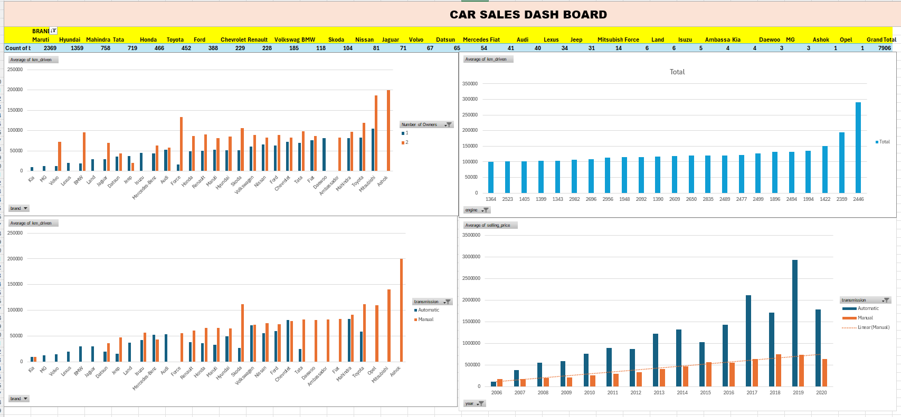

## README: Car Sales Dashboard

### Overview

This dashboard provides a comprehensive overview of car sales data, offering insights into various aspects of the automotive market. It includes visualizations such as bar charts, line charts, and pie charts to present the data in an easily understandable format.

### Key Features

* **Brand-wise Sales Analysis:** Compares sales performance across different car brands.
* **Monthly Sales Trends:** Tracks sales fluctuations over time.
* **Yearly Sales Comparison:** Evaluates sales patterns year-on-year.
* **Regional Sales Distribution:** Analyzes sales distribution across different regions.

### Usage Instructions

1. **Open the Dashboard:** Launch the dashboard file (likely an Excel workbook) on your computer.
2. **Explore Visualizations:** Examine the various charts and graphs to understand the data.
3. **Filter and Drill Down:** Use filters or interactive elements (if available) to explore specific aspects of the data.
4. **Export Data:** If needed, export the underlying data for further analysis or reporting.

### Data Sources

[Insert information about the data sources used to populate the dashboard, if available]

### Notes and Limitations

* **Data Accuracy:** Ensure the accuracy and reliability of the data used in the dashboard.
* **Data Updates:** Regularly update the data to maintain the relevance of the insights.
* **Dashboard Customization:** Consider customizing the dashboard to meet specific needs or preferences.

### Contact Information
* **Mail:** rohith05reddy@gmail.com
* **Linkedin:** https://www.linkedin.com/in/rohith-reddy-4b2340300?utm_source=share&utm_campaign=share_via&utm_content=profile&utm_medium=android_app

**Additional Tips:**

* **Leverage Filters:** Use filters to focus on specific brands, time periods, or regions.
* **Compare Metrics:** Compare different metrics (e.g., sales vs. revenue) to gain deeper insights.
* **Explore Trends:** Identify trends and patterns in the data to make informed decisions.

By effectively utilizing this dashboard, you can gain valuable insights into car sales trends, performance, and market dynamics.
